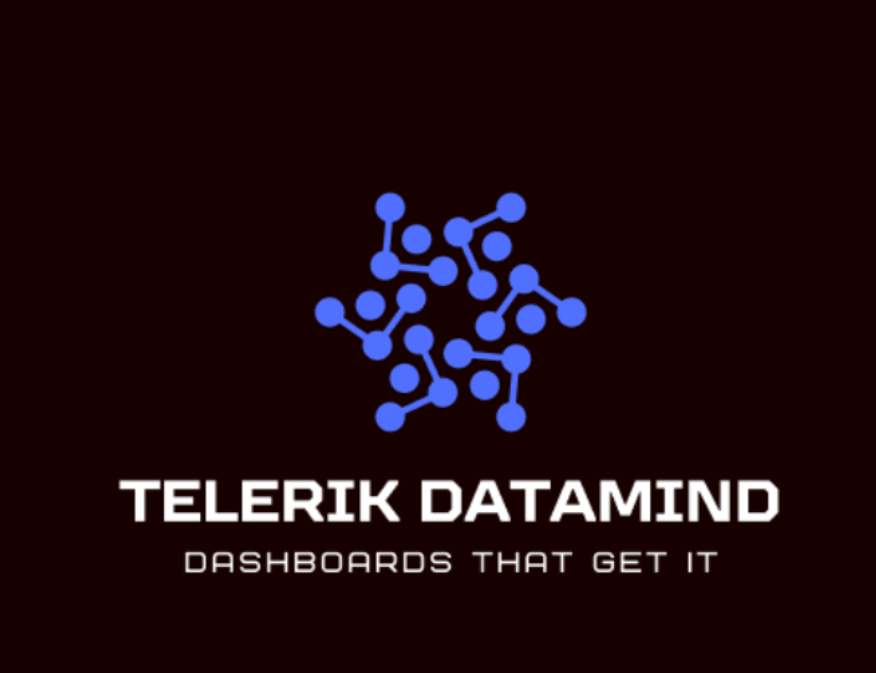

# Telerik DataMind

  

Telerik DataMind is an AI-powered data visualization project built with Telerik UI for ASP.NET Core, Kendo UI for jQuery, and OpenAI .NET library.
Developed as a hackathon idea, it demonstrates how intelligent analytics can help with the creation of business dashboards using the modern and responsive Kendo UI components.

---

## Overview

Telerik DataMind showcases how AI-driven insights can empower data visualization and decision-making inside a Telerik UI for ASP.NET Core web application.

The project's purpose is to:
- Generate interactive dashboards (reports) based on uploaded data file (.xlsx, .csv).
- Use Kendo UI components.
- Use AI to analyze the data and select the optimal UI components.
- Use natural language prompts for data analysis.

---

## Tech Stack

- ASP.NET Core 8.0
- OpenAI .NET library (version 1.9.2)
- Telerik UI for ASP.NET Core (version 2025.3.825)
- Kendo UI for jQuery Components:
  - Grid with AI-powered assistant
  - Charts: Bar, Column, Line, Pie, Donut, Area, Stock
  - Map
  - Scheduler
- Kendo UI Bootstrap Main Dark theme (version 12.0.0)

---

## Key Features

- Transform raw data (Excel, CSV) into interactive visualizations through a single click.
- Enter specific instructions through a prompt.
- Choose the desired UI components.
- Leverage AI to suggest optimal UI components and analyze the data.

---

## Team

- Anton Mironov – Full Stack Developer
- Mihaela Lukanova – Full Stack Developer
- Iva Bitsova – UI/UX Designer

---

## Setup Instructions

1. Clone the repository:
   git clone https://github.com/antonmironovv/TelerikDataMind-Public.git
   cd TelerikDataMind-Public

2. Open the solution in Visual Studio.

3. Restore NuGet packages: `dotnet restore`

4. Add Telerik NuGet feed:
   - Go to **Tools → Options → NuGet Package Manager → Package Sources**
   - Add:
     https://nuget.telerik.com/v3/index.json
   - Authenticate with your Telerik credentials.

5. Insert your OpenAI **ApiKey** and **DeploymentName** in the `appsettings.json`.

6. Run the project: `dotnet run`

7. Open your browser.

---

## Telerik License

A valid [Telerik UI for ASP.NET Core license](https://www.telerik.com/aspnet-core-ui/documentation/installation/activating-your-license/setting-up-your-license) is required to build and run this project.
If you are part of the hackathon team, please request license access from Anton Mironov.

---

© 2025 Telerik DataMind Team. All rights reserved
